# Building a streaming pipeline using SQL with Google Data Flow

## The architecture

Assuming that your development team is nice enough to build a streaming source of your order and customer data (this is actually a prerequisite), our architecture would look as follow. 

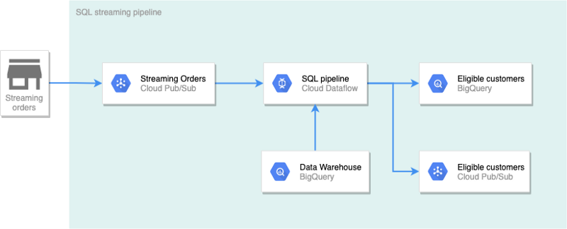

In this architecture, new orders (within the day) are streamed to Pub/Sub. The pipeline created by Dataflow will check every new purchase to see if the customer is within the list of customers who spent more than $5,000. The results will be written into two destinations. Results to BigQuery will be used for real-time dashboard with a visualization tool. Results written to Pub/Sub will be used to send push notifications to the winning customer. 

## Getting started

Here are some prerequisites to getting started: 
* A Google Cloud account
* An active billing account (you can sign up for the $300 free trial) 
* A Google Cloud project

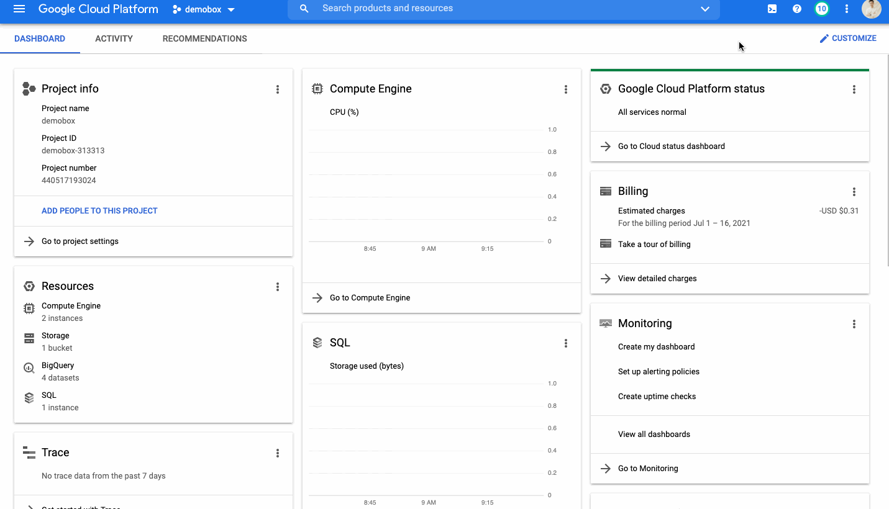


Clone this repo to the Cloudshell by running: 


```bash
# Clone the repo locally
git clone https://github.com/tuanchris/dataflow-sql
cd dataflow-sql
# Install requirements
pip3 install -r requirements.txt
```

## Create Data Sources

We need two data sources for our streaming pipelines as follow: 
1. A BigQuery Batch source -  all orders and customers information and is updated daily

    ``` bash
    # This script will create 100 customers with 1000 orders
    python3 generate_data.py batch \
    --customer_count=100 \
    --order_count=1000 \
    --project_id=$DEVSHELL_PROJECT_ID
    # Replace the project_id varaible if you are running locally
    ```

    Select `Authorize` when Cloud shell asks to authenticate your requests.

    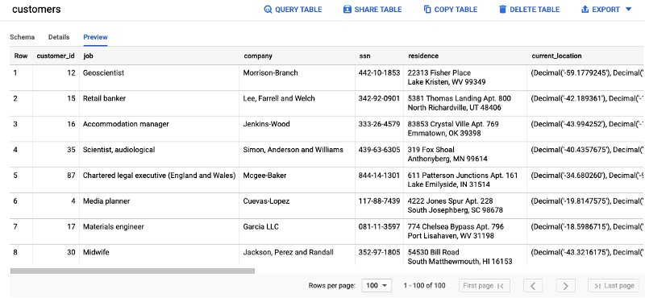

    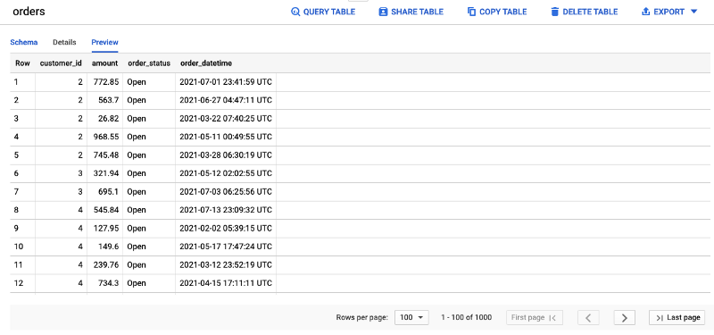

2. A Pub/Sub topic called orders - a stream of order data that arrives via a subscription to the Pub/Sub topic

    ```bash
    # Create a Pub/Sub topic
    gcloud pubsub topics create orders
    # Generate a stream of order data to Pub/Sub
    python3 generate_data.py stream \
    --customer_range 100 \
    --project_id $DEVSHELL_PROJECT_ID
    ```

    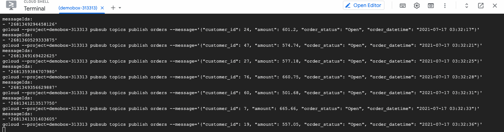

## Add Pub/Sub source to BigQuery

To add the Pub/Sub source to BigQuery, follow the following steps:

1. Change the query engine in BigQuery to Cloud Dataflow Engine

    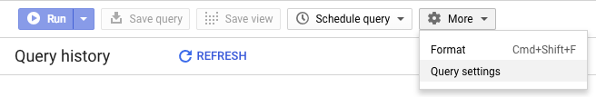

    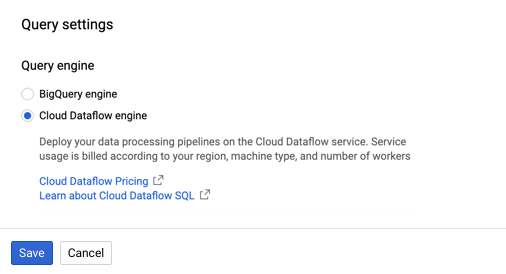

2. From the BigQuery UI, select Add Data and choose Cloud Dataflow sources

    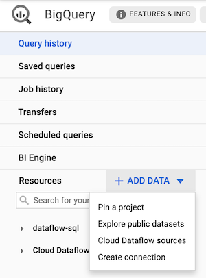

3. Add the Pub/Sub topic source

    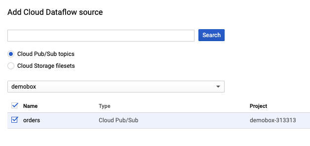

4. Add a schema for the orders topic

    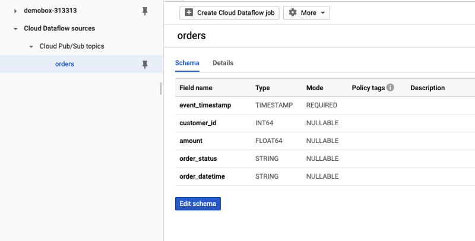

    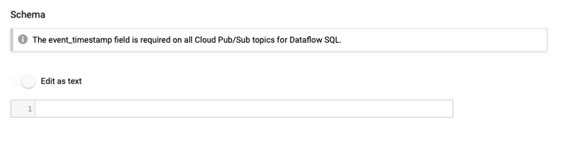

    ```json
    [
        {
            "name": "event_timestamp",
            "description": "",
            "mode": "REQUIRED",
            "type": "TIMESTAMP"
        },
        {
            "name": "customer_id",
            "description": "",
            "mode": "NULLABLE",
            "type": "INT64"
        },
        {
            "name": "amount",
            "description": "",
            "mode": "NULLABLE",
            "type": "FLOAT64"
        },
        {
            "name": "order_status",
            "description": "",
            "mode": "NULLABLE",
            "type": "STRING"
        },
        {
            "name": "order_datetime",
            "description": "",
            "mode": "NULLABLE",
            "type": "STRING"
        }
    ]
    ```

## Write a SQL query
Here is a simple SQL query that will answer our business question. 

```sql
WITH
  eligible_customers AS (
  SELECT
    o.customer_id,
    SUM(o.amount) AS total_spent
  FROM
    bigquery.table.`demobox-313313`.ecommerce.orders o
  WHERE
    o.order_status = 'Closed'
  GROUP BY
    1
  HAVING
    total_spent >= 5000)
SELECT
  o.*,
  ec.total_spent
FROM
  pubsub.topic.`demobox-313313`.orders o
INNER JOIN
  eligible_customers ec
USING
  (customer_id)
WHERE
  o.order_status != 'Cancelled'
```

We first select the data from the orders table, filter out only "Closed" orders, then group by the customer, calculate total spending, and filter out customers who purchased $5,000 or more. We then inner join the list of eligible customers to any new transactions, filtering out transactions with Cancelled status. 

You can see that it is easy writing SQL like above, and any Analyst can do it. Be sure to substitute your project_id when trying this out. 

## Create a Dataflow job

With the query ready and validate, you can select Create Dataflow job from the BigQuery UI. Configure two destinations as per the image below. You can keep other values to the default one.

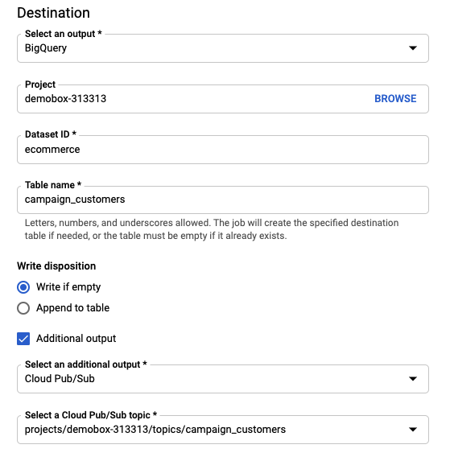

After creating the Dataflow job, you can see the result below. Follow the link in Job ID to view your Dataflow job and its status. 

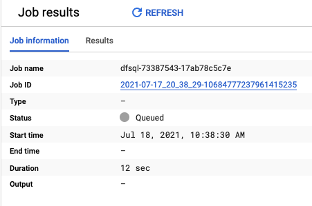

It can take 3–5 minutes for the Dataflow job to startup. After that, you should be able to the pipeline as follow.

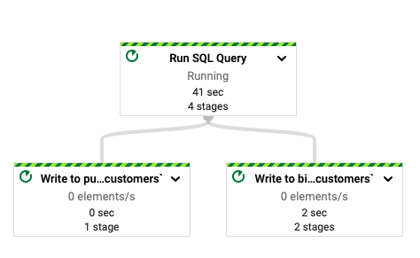

## Verifying the results

After the Dataflow job is successfully startup and running, you can go to BigQuery and Pub/Sub to verify that our pipeline is working as intended. 

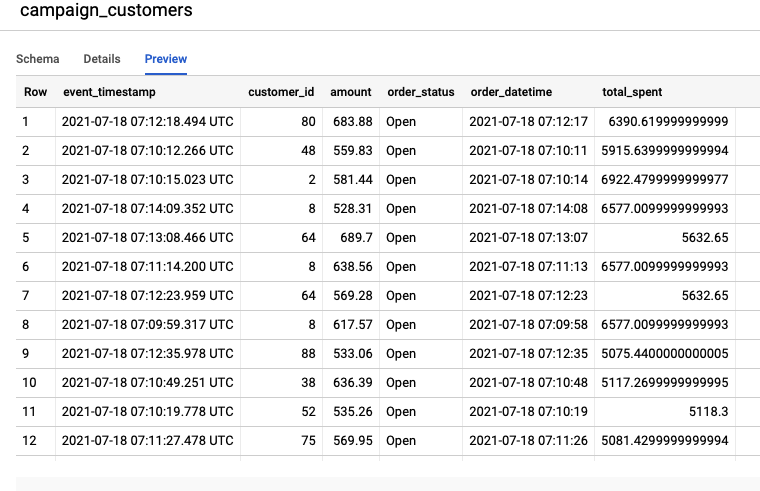

With the running Dataflow job, we can see all sorts of job metrics about our pipeline. For example, it takes 11 seconds for the data to be processed by Dataflow, not bad!

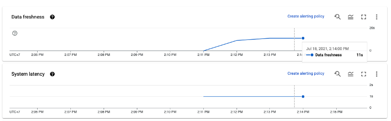

## Clean up

Be sure to cancel the Dataflow pipeline, delete the Pub/Sub topic, and delete the BigQuery dataset to avoid incurring costs. 

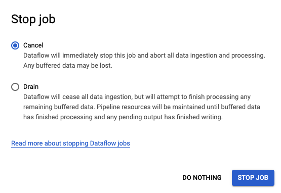
